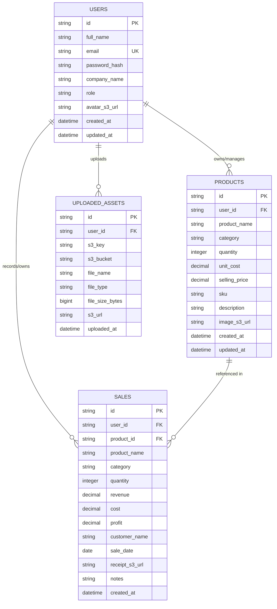

# Database Entity-Relationship Diagram (ERD) - Sales Tracker Pro

This document outlines the Database Entity-Relationship Diagram (ERD) for the **Sales Tracker Pro** cloud application as part of the CSBC 252 Capstone Project.

## ERD Diagram (Mermaid)

## Entity Descriptions

### 1. `USERS`
Stores application user accounts, credentials (hashed using bcrypt), profile details, and S3 avatar storage URLs.

### 2. `PRODUCTS`
Manages inventory items. Each item belongs to a specific user, includes stock counts, pricing, cost tracking, and an S3 product image URL.

### 3. `SALES`
Records transaction logs. Computes `profit = revenue - cost` dynamically. Connects optionally to `PRODUCTS` and stores an S3 uploaded receipt URL.

### 4. `UPLOADED_ASSETS`
Tracks all files programmatically sent to Amazon S3 (bucket name, object key, file mime-type, and public/presigned URL), maintaining zero file footprint on EC2 local storage.
