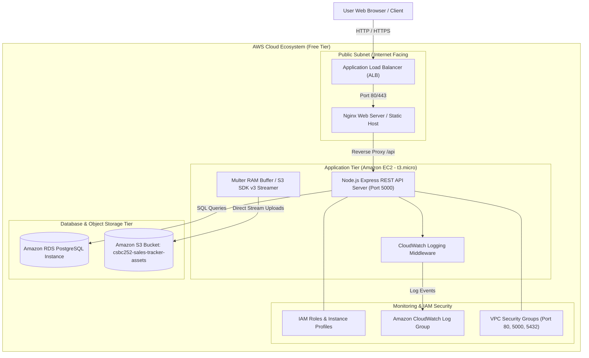
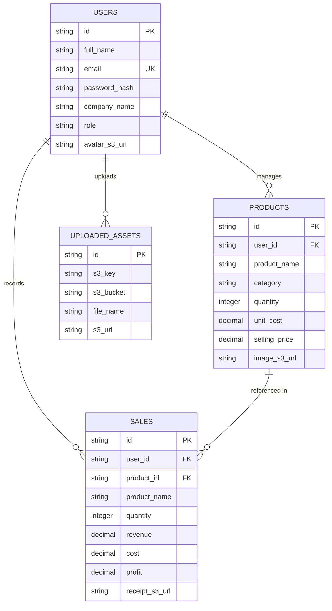

# CSBC 252 Capstone System Design Document: Sales Tracker Pro

## 1. AWS 3-Tier Architecture Diagram



---

## 2. Use Case Diagram & Flow

```mermaid
usecaseDiagram
    actor Merchant as "Store Merchant / User"
    actor Admin as "System Admin"
    
    package "Sales Tracker Pro System" {
        usecase "Authenticate (Register/Login)" as UC1
        usecase "Manage Inventory (Create, Read, Update, Delete)" as UC2
        usecase "Upload Product Image to Amazon S3" as UC3
        usecase "Record Sale Transaction" as UC4
        usecase "Upload Receipt PDF to Amazon S3" as UC5
        usecase "View Financial Dashboard & Profit Reports" as UC6
        usecase "Monitor Application Health & CloudWatch Logs" as UC7
    }
    
    Merchant --> UC1
    Merchant --> UC2
    Merchant --> UC3
    Merchant --> UC4
    Merchant --> UC5
    Merchant --> UC6
    
    Admin --> UC1
    Admin --> UC7
```

---

## 3. Database Entity-Relationship Diagram (ERD)



---

## 4. Security & Network Isolation Specifications

1. **Security Groups**:
   - `ec2-web-sg`: Inbound TCP 80, 443, 5000 from 0.0.0.0/0.
   - `rds-db-sg`: Inbound TCP 5432 restricted strictly to `ec2-web-sg` ID.
2. **IAM Least Privilege Policy**:
   - Policy `SalesTrackerS3AccessPolicy`: Allows `s3:PutObject`, `s3:GetObject`, `s3:ListBucket` strictly for `arn:aws:s3:::csbc252-sales-tracker-assets/*`.
   - Policy `SalesTrackerCloudWatchPolicy`: Allows `logs:CreateLogStream`, `logs:PutLogEvents`.
3. **Data Protection**:
   - Environment secrets passed securely via systemd environment parameters or AWS Secrets Manager.
