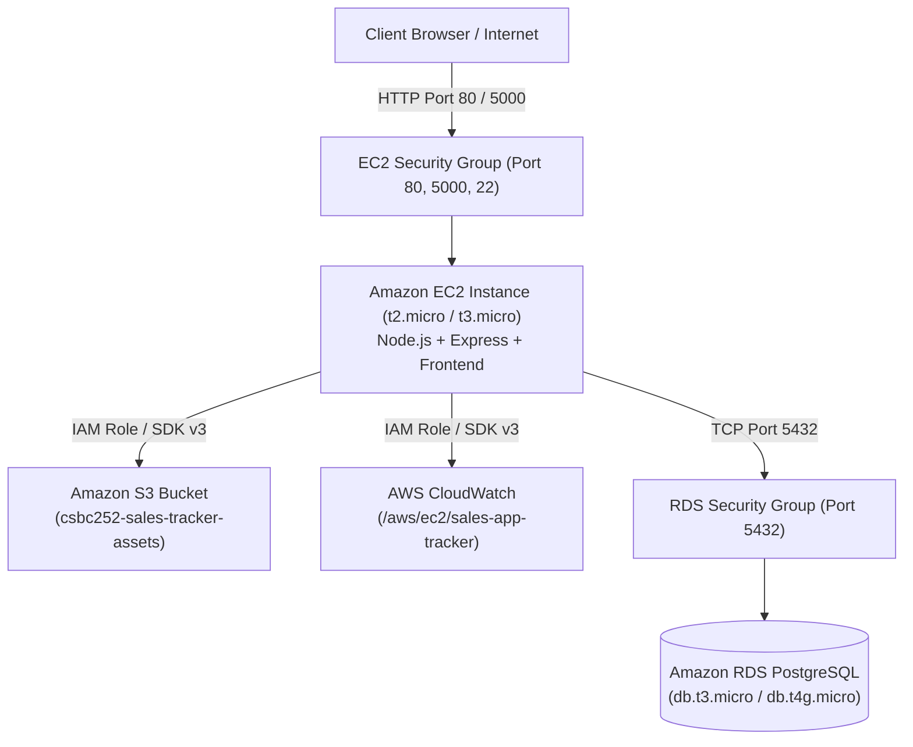

# Sales Tracker Pro — AWS EC2 Deployment Guide

Comprehensive step-by-step guide for deploying **Sales Tracker Pro** to **Amazon EC2** under the **AWS Free Tier**, meeting all CSBC 252 Capstone requirements (IAM, EC2, Amazon RDS PostgreSQL, Amazon S3, Security Groups, and CloudWatch).

---

## 1. Target Architecture Overview



---

## 2. Step 1: Create IAM Role for EC2

An IAM Role allows your EC2 instance to interact with **Amazon S3** and **CloudWatch Logs** securely without embedding hardcoded access keys in `.env`.

1. Go to **AWS Console** $\rightarrow$ **IAM** $\rightarrow$ **Roles** $\rightarrow$ Click **Create role**.
2. Select **AWS service** and choose **EC2** as the use case.
3. Attach the following managed policies:
   - `AmazonS3FullAccess` (or custom least-privilege policy for your bucket)
   - `CloudWatchLogsFullAccess`
4. Name the role: **`SalesTrackerEC2Role`** and click **Create role**.

---

## 3. Step 2: Create Amazon S3 Bucket

1. Go to **Amazon S3** $\rightarrow$ Click **Create bucket**.
2. **Bucket name**: e.g., `csbc252-sales-tracker-assets` *(must be globally unique)*.
3. **AWS Region**: Select `us-east-1` (or your preferred region).
4. Leave **Block Public Access** settings as per your security guidelines.
5. Under **Permissions** $\rightarrow$ **Cross-origin resource sharing (CORS)**, paste:
   ```json
   [
     {
       "AllowedHeaders": ["*"],
       "AllowedMethods": ["GET", "PUT", "POST", "DELETE", "HEAD"],
       "AllowedOrigins": ["*"],
       "ExposeHeaders": ["ETag"]
     }
   ]
   ```
6. Click **Save changes**.

---

## 4. Step 3: Configure AWS Security Groups

Create two Security Groups to enforce network segmentation:

### A. EC2 Web Security Group (`ec2-web-sg`)
| Type | Protocol | Port Range | Source | Description |
| :--- | :--- | :--- | :--- | :--- |
| **SSH** | TCP | `22` | `My IP` (or `0.0.0.0/0`) | SSH administrative access |
| **HTTP** | TCP | `80` | `0.0.0.0/0` | Web traffic (Nginx/Direct) |
| **Custom TCP** | TCP | `5000` | `0.0.0.0/0` | Express Backend API port |

### B. RDS Database Security Group (`rds-db-sg`)
| Type | Protocol | Port Range | Source | Description |
| :--- | :--- | :--- | :--- | :--- |
| **PostgreSQL** | TCP | `5432` | `sg-xxxxxx (ec2-web-sg)` | Allow database traffic **only** from EC2 |

---

## 5. Step 4: Create Amazon RDS (PostgreSQL) Database

1. Go to **Amazon RDS** $\rightarrow$ Click **Create database**.
2. **Engine**: PostgreSQL (Version 15 or 16).
3. **Template**: **Free Tier**.
4. **Settings**:
   - DB instance identifier: `sales-tracker-rds`
   - Master username: `postgres`
   - Master password: `YourSecurePassword123!`
5. **Instance configuration**: `db.t3.micro` or `db.t4g.micro`.
6. **Connectivity**:
   - VPC: Default VPC
   - Public access: **No** *(recommended)* or **Yes** *(if populating from local machine)*
   - VPC security group: Select **`rds-db-sg`**.
7. Under **Additional configuration**:
   - Initial database name: `sales_tracker`
8. Click **Create database** (takes ~5–10 minutes).
9. Once **Available**, copy the **Endpoint** (e.g. `sales-tracker-rds.cxxxx.us-east-1.rds.amazonaws.com`).

---

## 6. Step 5: Launch & Configure the Amazon EC2 Instance

1. Go to **Amazon EC2** $\rightarrow$ Click **Launch Instance**.
2. **Name**: `Sales-Tracker-Backend-EC2`
3. **AMI**: **Amazon Linux 2023 AMI** (or Ubuntu 22.04 LTS) — *Free Tier eligible*.
4. **Instance Type**: `t2.micro` (or `t3.micro`).
5. **Key Pair**: Select or create a key pair (e.g. `sales-key.pem`) and download it.
6. **Network Settings**:
   - Select existing security group: **`ec2-web-sg`**.
7. **Advanced Details**:
   - **IAM instance profile**: Select **`SalesTrackerEC2Role`**.
8. Click **Launch instance**.

---

## 7. Step 6: Connect to EC2 and Deploy the Application

### 1. SSH into the EC2 Instance
From your local terminal (Windows PowerShell or macOS/Linux):
```bash
# Set key permissions (macOS/Linux only)
chmod 400 sales-key.pem

# SSH into EC2 (replace with your EC2 Public IPv4 IP)
ssh -i "sales-key.pem" ec2-user@<YOUR_EC2_PUBLIC_IP>
```

---

### 2. Install Node.js, Git, and PostgreSQL Client
On Amazon Linux 2023:
```bash
sudo dnf update -y
sudo dnf install -y nodejs npm git postgresql15
```
*(If on Ubuntu 22.04, use `sudo apt update && sudo apt install -y nodejs npm git postgresql-client`)*

Verify versions:
```bash
node -v   # Should be v18+
npm -v
```

---

### 3. Clone Repository & Setup Project Directory
```bash
# Clone the repository
git clone https://github.com/DonBort/Sales-App-Tracker.git /var/www/sales-tracker
cd /var/www/sales-tracker/backend

# Fix permissions
sudo chown -R $USER:$USER /var/www/sales-tracker

# Install production dependencies
npm install --production
```

---

### 4. Initialize Database Schema & Seed Data
Run the SQL migration scripts against your RDS instance:
```bash
# Initialize schema
PGPASSWORD='YourSecurePassword123!' psql -h <RDS_ENDPOINT> -U postgres -d sales_tracker -f ../database/schema.sql

# Seed initial admin & demo products
PGPASSWORD='YourSecurePassword123!' psql -h <RDS_ENDPOINT> -U postgres -d sales_tracker -f ../database/seed.sql
```

---

### 5. Create the `.env` File
Inside `/var/www/sales-tracker/backend/`:
```bash
nano .env
```
Add the production configuration:
```env
PORT=5000
NODE_ENV=production
DATABASE_URL=postgresql://postgres:YourSecurePassword123!@<RDS_ENDPOINT>:5432/sales_tracker
JWT_SECRET=super_secret_production_jwt_key_csbc252
AWS_REGION=us-east-1
S3_BUCKET_NAME=csbc252-sales-tracker-assets
CLOUDWATCH_LOG_GROUP=/aws/ec2/sales-app-tracker
```
*(Press `Ctrl + O` $\rightarrow$ `Enter` to save, then `Ctrl + X` to exit).*

---

### 6. Enable and Start the Systemd Background Service
The repository includes `sales-backend.service` to keep the app running continuously:

```bash
# Copy systemd service file
sudo cp sales-backend.service /etc/systemd/system/sales-backend.service

# Reload systemd and start service
sudo systemctl daemon-reload
sudo systemctl enable sales-backend
sudo systemctl start sales-backend

# Verify status
sudo systemctl status sales-backend
```

---

## 8. Step 7: Configure Nginx as Reverse Proxy (Port 80 $\rightarrow$ Port 5000)

To allow visitors to access the website on standard HTTP (Port 80) without adding `:5000`:

1. **Install Nginx**:
   ```bash
   sudo dnf install -y nginx
   ```

2. **Configure Nginx**:
   ```bash
   sudo nano /etc/nginx/conf.d/sales-tracker.conf
   ```
   Add:
   ```nginx
   server {
       listen 80;
       server_name _;

       location / {
           proxy_pass http://127.0.0.1:5000;
           proxy_http_version 1.1;
           proxy_set_header Upgrade $http_upgrade;
           proxy_set_header Connection 'upgrade';
           proxy_set_header Host $host;
           proxy_cache_bypass $http_upgrade;
           proxy_set_header X-Real-IP $remote_addr;
           proxy_set_header X-Forwarded-For $proxy_add_x_forwarded_for;
       }
   }
   ```

3. **Start Nginx**:
   ```bash
   sudo systemctl enable nginx
   sudo systemctl restart nginx
   ```

---

## 9. Step 8: Verify Live Deployment

1. **Health Check Endpoint**:
   ```bash
   curl http://<YOUR_EC2_PUBLIC_IP>/api/health
   ```
   Expected response:
   ```json
   {
     "status": "healthy",
     "service": "sales-tracker-backend",
     "awsRegion": "us-east-1",
     "s3Bucket": "csbc252-sales-tracker-assets"
   }
   ```

2. **Frontend UI**:
   - Open in browser: `http://<YOUR_EC2_PUBLIC_IP>/login.html`
   - Login with:
     - **Email**: `admin@salestracker.cloud`
     - **Password**: `admin1234567890`

3. **CloudWatch Verification**:
   - Go to **AWS CloudWatch** $\rightarrow$ **Log groups** $\rightarrow$ `/aws/ec2/sales-app-tracker`.
   - Confirm log streams are tracking API requests.

---

## 10. Capstone Deliverable Checklist (Screenshots Needed)

Take the required 6 screenshots for `docs/03_DEPLOYMENT_PROOF_PORTFOLIO.md`:

- [ ] **1. IAM Role**: Showing `SalesTrackerEC2Role` with S3 and CloudWatch policies.
- [ ] **2. EC2 Instance**: Showing `Running` state and Public IP address.
- [ ] **3. Security Groups**: Showing inbound rules for Ports `22`, `80`, `5000`, and `5432`.
- [ ] **4. RDS PostgreSQL**: Showing status `Available` on `db.t3.micro`.
- [ ] **5. S3 Bucket**: Showing uploaded receipts/avatars in `csbc252-sales-tracker-assets`.
- [ ] **6. CloudWatch Logs**: Showing incoming request metrics and 200 HTTP codes.
